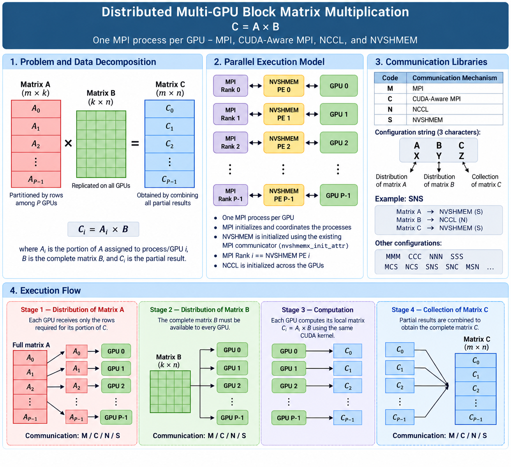

## 1. Overview



Matrix $A$ is partitioned by rows across the MPI processes/GPUs, whereas matrix $B$ must be accessible to every GPU.

Each process computes a local portion of matrix $C$:

$$
C_i = A_i \times B
$$

where:

* \($A_i$\) is the portion of matrix $A$ assigned to $GPU_i$;
* \($B$\) is the complete matrix $B$;
* \($C_i$\) is the partial result computed by $GPU_i$.

The partial matrices \($C_i$\) are then combined to obtain the complete result matrix:

$$
C =
\begin{bmatrix}
C_0 \\
C_1 \\
\vdots \\
C_{P-1}
\end{bmatrix}
$$

where \($P$\) is the number of MPI processes, GPUs, and NVSHMEM Processing Elements (PEs).

---

## 2. Parallel Execution Model

The application follows a **one MPI process per GPU** execution model.

Each MPI rank is associated with:

1. one CUDA device;
2. one NVSHMEM Processing Element (PE);
3. one participant in the NCCL communicator.

Conceptually:

```text
MPI Rank 0  --->  NVSHMEM PE 0  --->  GPU 0
MPI Rank 1  --->  NVSHMEM PE 1  --->  GPU 1
MPI Rank 2  --->  NVSHMEM PE 2  --->  GPU 2
     ...              ...              ...
MPI Rank P-1  ->  NVSHMEM PE P-1  ->  GPU P-1
```

MPI initializes and coordinates the distributed processes.

NVSHMEM is initialized using the existing MPI communicator:

```cpp
nvshmemx_init_attr(NVSHMEMX_INIT_WITH_MPI_COMM, &attr);
```

The implementation verifies that MPI ranks and NVSHMEM PEs have a consistent mapping:

```text
MPI Rank i == NVSHMEM PE i
```

NCCL is also initialized across the GPUs associated with the MPI ranks.

This architecture allows the same GPU computation kernel to be evaluated using four different communication mechanisms.

---

## 3. Communication Libraries

The communication mechanism used for matrices **A**, **B**, and **C** can be selected independently through a three-character configuration string.

The available options are:

| Code | Communication Mechanism |
| ---- | ----------------------- |
| `M`  | MPI                     |
| `C`  | CUDA-Aware MPI          |
| `N`  | NCCL                    |
| `S`  | NVSHMEM                 |

The three positions in the configuration string correspond to:

```text
communication_libraries[0] -> distribution of matrix A
communication_libraries[1] -> broadcast/distribution of matrix B
communication_libraries[2] -> collection of matrix C
```

For example:

```text
SNS
```

means:

```text
Matrix A  -> NVSHMEM
Matrix B  -> NCCL
Matrix C  -> NVSHMEM
```

Other possible configurations include:

```text
MMM
CCC
NNN
SSS

MCS
NCS
SNS
SNC
MSN
```

This design enables different combinations of communication mechanisms to be evaluated without modifying the computation kernel.

---

## 4. Execution Flow

The general execution flow is:

```text
                 Matrix A                    Matrix B
                    |                           |
                    v                           v
             Distribution                  Distribution
             M / C / N / S                 M / C / N / S
                    |                           |
                    +------------+--------------+
                                 |
                                 v
                         Multiple GPUs / PEs
                                 |
                                 v
                         GPU_i: C_i = A_i x B
                                 |
                                 v
                           Collection of C
                            M / C / N / S
```

The computation can be divided into three main communication stages.

### Stage 1 — Distribution of Matrix A

Matrix $A$ is partitioned among the GPUs.

Each GPU receives only the rows required to compute its corresponding portion of matrix **C**.

### Stage 2 — Distribution of Matrix B

Matrix $B$ must be available to every GPU participating in the computation.

Therefore, the complete matrix $B$ is made available to all participating processes/GPUs.

### Stage 3 — Collection of Matrix C

After each GPU computes its local matrix:

$$
C_i = A_i \times B
$$

the partial results are collected to construct the complete matrix $C$.

---

## 5. Communication Operations

### Matrix A

The distribution of matrix $A$ depends on the selected communication mechanism:

| Option | Operation                                                    |
| ------ | ------------------------------------------------------------ |
| `M`    | `MPI_Scatter` using host memory                              |
| `C`    | `MPI_Scatter` directly using GPU memory                      |
| `N`    | `ncclBroadcast` followed by selection of the local partition |
| `S`    | `nvshmem_double_get` from PE 0                               |

For NVSHMEM, each PE performs a one-sided read of its corresponding portion of matrix $A$:

```cpp
nvshmem_double_get(s_lA,  s_A + (size_t)myPE * mi * k, (size_t)mi * k, 0);
```

Thus, each PE directly retrieves its required block from the symmetric memory allocated on **PE 0**.

---

### Matrix B

Matrix $B$ must be available to all participating GPUs:

| Option | Operation                             |
| ------ | ------------------------------------- |
| `M`    | `MPI_Bcast` using host memory         |
| `C`    | `MPI_Bcast` directly using GPU memory |
| `N`    | `ncclBroadcast`                       |
| `S`    | Chunked asynchronous GETs from PE 0 using a double-buffer pipeline |

For NVSHMEM, matrix **B** is not fetched as one blocking transfer. The current code partitions **B** along the K dimension and stages two chunks in ping-pong buffers. Remote PEs use `nvshmemx_double_get_nbi_on_stream()` followed by `nvshmemx_quiet_on_stream()`, while PE 0 uses a local asynchronous device-to-device copy:

```cpp
if (my_pe == source_pe)
    cudaMemcpyAsync(dst, src, count * sizeof(double), cudaMemcpyDeviceToDevice, stream);
else 
{
    nvshmemx_double_get_nbi_on_stream(dst, src, count, source_pe, stream);
    nvshmemx_quiet_on_stream(stream);
}
```

This transfer is issued on `comm_stream` and overlapped with GEMM work on `compute_stream`.

---

### Matrix C

The partial results are combined using:

| Option | Operation                                                    |
| ------ | ------------------------------------------------------------ |
| `M`    | `MPI_Gather` using host memory                               |
| `C`    | `MPI_Gather` directly using GPU memory                       |
| `N`    | `ncclAllGather`                                              |
| `S`    | PE 0 retrieves the local C blocks using `nvshmem_double_get` |

With NVSHMEM, PE 0 obtains the partial result from every PE:

```cpp
if (myPE == 0)
{
    for (int pe = 0; pe < nPEs; ++pe)
    {
        nvshmem_double_get(s_C + (size_t)pe * mi * n, s_lC, (size_t)mi * n, pe);
    }
}
```

The complete matrix $C$ is therefore assembled in PE 0's symmetric memory.

---

## 6. NVSHMEM Symmetric Memory

One of the main differences introduced by the NVSHMEM implementation is the use of **symmetric memory**.

The following symmetric GPU buffers are allocated:

```cpp
double *s_A;
double *s_B;
double *s_C;
double *s_lA;
double *s_lC;
```

using:

```cpp
nvshmem_malloc()
```

Conceptually:

```text
                 NVSHMEM Symmetric Heap

PE 0 / GPU 0       PE 1 / GPU 1       PE 2 / GPU 2
+-----------+      +-----------+      +-----------+
|   s_A     |      |   s_A     |      |   s_A     |
|   s_B     |      |   s_B     |      |   s_B     |
|   s_C     |      |   s_C     |      |   s_C     |
|   s_lA    |      |   s_lA    |      |   s_lA    |
|   s_lC    |      |   s_lC    |      |   s_lC    |
+-----------+      +-----------+      +-----------+
      ^                  ^                  ^
      |                  |                  |
      +-------- NVSHMEM one-sided ----------+
                communication
```

The symmetric-memory model allows a PE to directly access memory associated with another PE through NVSHMEM communication operations.

This differs from the traditional MPI two-sided communication model, where both sender and receiver participate explicitly in the communication operation.

---

## 7. NVSHMEM Communication Model

The NVSHMEM implementation uses both blocking and stream-ordered one-sided operations. Matrix $A$ and the final collection of $C$ use `nvshmem_double_get()`. The pipelined path for matrix $B$ uses:

```cpp
nvshmemx_double_get_nbi_on_stream()
nvshmemx_quiet_on_stream()
```

These operations follow a **one-sided communication model**. The stream-ordered path additionally allows communication to progress concurrently with GPU computation.

Conceptually:

```text
Traditional MPI

PE 0                         PE 1
 |                            |
 | MPI_Send                   |
 | -------------------------> |
 |                            | MPI_Recv
 |                            |
```

With NVSHMEM:

```text
NVSHMEM

PE 0                         PE 1
 |                            |
 |       symmetric data       |
 |                            |
 | <------ GET issued --------|
 |                            |
```

The requesting PE initiates the data transfer directly.

For matrix $A$:

```text
PE i
 |
 | nvshmem_double_get()
 v
PE 0: s_A
 |
 v
PE i: s_lA
```

For matrix $B$:

```text
PE i
 |
 | asynchronous NVSHMEM GET
 v
PE 0: s_B
 |
 v
PE i: s_B
```

For matrix $C$, PE $0$ retrieves the results:

```text
PE 0
 |
 +---- GET ---- PE 0:s_lC
 |
 +---- GET ---- PE 1:s_lC
 |
 +---- GET ---- PE 2:s_lC
 |
 +---- GET ---- PE N:s_lC
 |
 v
PE 0:s_C
```

---

## 8. Synchronization

NVSHMEM synchronization is performed using:

```cpp
nvshmem_barrier_all();
```

For example, after PE 0 initializes matrices $A$ and $B$:

```cpp
nvshmem_barrier_all();
```

ensures that initialization is complete before other PEs attempt to retrieve the data.

Synchronization is also performed after NVSHMEM communication operations where required by the current implementation. For the pipelined $B$ path, CUDA events express dependencies without globally synchronizing the device:

```cpp
cudaEventRecord(b_ready[i], comm_stream);
cudaStreamWaitEvent(compute_stream, b_ready[i], 0);

cudaEventRecord(compute_done[i], compute_stream);
cudaStreamWaitEvent(comm_stream, compute_done[i], 0);
```

The non-pipelined CUDA path uses `cudaDeviceSynchronize()`, while the optimized NVSHMEM path synchronizes `compute_stream` after the last chunk. NCCL operations are synchronized through:

```cpp
cudaStreamSynchronize(s);
```

---

## 9. GPU Computation

The local matrix multiplication is performed by:

```cpp
ABMultiply()
```

which is defined in:

```text
mulmat_kernel.cu
```

The CUDA implementation uses **tiled matrix multiplication**.

Tiles from matrices $A$ and $B$ are loaded into GPU shared memory and multiplied to compute the corresponding tile of matrix $C$.

Conceptually:

```text
Global GPU Memory
       |
       +---- Tile A ----+
       |                |
       +---- Tile B ----+
                |
                v
           Shared Memory
                |
                v
         Tile Multiplication
                |
                v
            Tile of C
```

The tile dimension is defined as:

```cpp
#define TILE_DIM 32
```

The kernel uses two shared-memory tiles:

```cpp
double *aTile;
double *bTile;
```

and the CUDA kernel is launched by:

```cpp
sharedABMultiply<<<grid, block, 2*w*w*sizeof(double)>>>(a, b, c, m, n, k, lda, ldb, ldc, w);
```

---

## 10. Selecting the Buffers for the CUDA Kernel

The same CUDA matrix multiplication kernel is used regardless of the selected communication mechanism.

The input and output buffers are dynamically selected according to the configuration:

```cpp
double *kernel_A = (libA == 'S') ? s_lA : d_lA;
double *kernel_B = (libB == 'S') ? s_B  : d_B;
double *kernel_C = (libC == 'S') ? s_lC : d_lC;
```

For `libB != 'S'`, the multiplication is executed by the regular tiled kernel through `ABMultiply()`. For `libB == 'S'`, `kernel_B` is not consumed directly by the GEMM; instead, chunks from symmetric `s_B` are prefetched into `b_stage[0]` and `b_stage[1]`, and each chunk is accumulated into `kernel_C` with:

```cpp
ABMultiplyAccumulateAsync(kernel_A, b_stage[current], kernel_C, mi, n, k, k_offset, k_chunk, k, n, n, w, compute_stream);
```

---

## 11. Source Files

The main source files are:

```text
.
├── mmb.cu
├── mulmat_kernel.cu
├── makefile
└── experimental-results/
    ├── script-execution-1node-4GPUs.sh
    ├── plot.py
    └── result--*.txt
```

### `mmb.cu`

Implements:

* MPI initialization;
* GPU selection;
* NVSHMEM initialization;
* MPI Rank / NVSHMEM PE mapping;
* NCCL communicator initialization;
* host-memory allocation;
* CUDA device-memory allocation;
* NVSHMEM symmetric-memory allocation;
* matrix initialization;
* communication mechanism selection;
* distribution of matrix A;
* distribution of matrix B;
* invocation of the CUDA matrix multiplication kernel;
* collection of matrix C;
* execution-time measurement;
* numerical validation of the final matrix C on MPI rank 0;
* double-buffer allocation for the NVSHMEM **B** pipeline;
* asynchronous communication/computation overlap;
* resource cleanup.

### `mulmat_kernel.cu`

Implements the CUDA kernels responsible for matrix multiplication, including:

```cpp
simpleMultiply()
```

and the tiled shared-memory kernel:

```cpp
sharedABMultiply()
```

The function `ABMultiply()` configures and launches the standard tiled CUDA kernel. The optimized NVSHMEM path additionally uses `sharedABMultiplyAccumulate()` and `ABMultiplyAccumulateAsync()` to accumulate partial products from successive K chunks on `compute_stream`.

This file also contains the numerical-validation module:

```cpp
validate_C_kernel()
validate_matrix_C()
```

`validate_C_kernel()` checks the elements of the final matrix directly on the GPU, while `validate_matrix_C()` launches the validation kernel and reports the number of invalid elements, maximum absolute error, maximum relative error, and the final `PASS`/`FAIL` status. Matrix $C$ itself is not copied to host memory for validation.

---

## 12. Command-Line Arguments

The executable accepts three command-line arguments:

```text
mmb <device_id> <matrix_size> <communication_configuration>
```

where:

| Argument                      | Description                                 |
| ----------------------------- | ------------------------------------------- |
| `device_id`                   | CUDA device associated with the MPI process |
| `matrix_size`                 | Dimension of the square matrices            |
| `communication_configuration` | Three-character communication configuration |

For example:

```bash
./mmb 0 8192 SNS
```

selects:

```text
CUDA Device : 0
Matrix Size : 8192 x 8192

A : NVSHMEM
B : NCCL
C : NVSHMEM
```

The communication configuration must contain exactly three characters selected from:

```text
M
C
N
S
```

---

## 13. Example Communication Configurations

### MPI only

```text
MMM
```

```text
A -> MPI
B -> MPI
C -> MPI
```

### CUDA-Aware MPI only

```text
CCC
```

```text
A -> CUDA-Aware MPI
B -> CUDA-Aware MPI
C -> CUDA-Aware MPI
```

### NCCL only

```text
NNN
```

```text
A -> NCCL
B -> NCCL
C -> NCCL
```

### NVSHMEM only

```text
SSS
```

```text
A -> NVSHMEM
B -> NVSHMEM
C -> NVSHMEM
```

### Hybrid example

```text
SNS
```

```text
A -> NVSHMEM
B -> NCCL
C -> NVSHMEM
```

This approach allows the communication strategy for each matrix to be selected independently.

---

## 14. Build Configuration

The `makefile` obtains CUDA, NVSHMEM, and NCCL installation paths from the environment:

```bash
export CUDA_HOME=/path/to/cuda
export NVSHMEM_HOME=/path/to/nvshmem
export NCCL_HOME=/path/to/nccl
make
```

The current build targets NVIDIA Volta (`sm_70`) and uses relocatable device code (`-rdc=true`), which is required by the NVSHMEM device-linking path. The executable generated is `mmb`. Compilation is performed with:

```bash
make
```

For one node with four GPUs, using one MPI process per GPU, a complete MPI-only execution can be launched with:

```bash
mpirun -np 1 ./mmb 0 2048 MMM : \
       -np 1 ./mmb 1 2048 MMM : \
       -np 1 ./mmb 2 2048 MMM : \
       -np 1 ./mmb 3 2048 MMM
```

The same command can be used with `CCC`, `NNN`, or `SSS` to evaluate the other communication mechanisms.

---

## 15. Performance Measurement

The execution time is measured using:

```cpp
MPI_Wtime()
```

The benchmark performs the matrix multiplication multiple times:

```cpp
const int loop_count = 10;
```

The average execution time is calculated as:

```cpp
elapsed_time = stop_time - start_time;

double avg_time = elapsed_time / (double)loop_count;
```

This enables direct comparisons among configurations such as:

```text
MMM
CCC
NNN
SSS
SNS
SNC
NCS
MSN
```

for the same computational workload and matrix size.

---

## 16. Numerical Validation

The current version includes GPU-based numerical validation of the final matrix $C$. The validation is executed **after the timed benchmark region**, so it does not contribute to the execution time reported by the performance measurements.

The benchmark initializes the input matrices with:

```text
A[i,j] = 1.0
B[i,j] = 2.0
```

For square matrices of order `k`, every element of the expected result is therefore:

$$
C[i,j] = \sum_{p=0}^{k-1} A[i,p]B[p,j] = 2k
$$

Accordingly, `mmb.cu` defines:

```cpp
const double expected_C = 2.0 * (double)k;
const double abs_tol = 1.0e-9;
const double rel_tol = 1.0e-12;
```

Only MPI rank 0 validates the complete result. For MPI, CUDA-Aware MPI, and NCCL collection paths, validation uses `d_C`. When matrix **C** is collected with NVSHMEM, validation uses the symmetric buffer `s_C`:

```cpp
const double *validation_C = (libC == 'S') ? s_C : d_C;

validate_matrix_C(validation_C, m, n, expected_C,
                  abs_tol, rel_tol, myRank);
```

The CUDA kernel evaluates each element using both absolute and relative error. An element is classified as invalid only when **both** tolerances are exceeded:

```cpp
if ((abs_error > abs_tol) && (rel_error > rel_tol))
    atomicAdd(error_count, 1ULL);
```

The validation reports:

```text
NUMERICAL VALIDATION
Matrix dimensions
Expected C[i,j]
Elements checked
Invalid elements
Max absolute error
Max relative error
Absolute tolerance
Relative tolerance
Result: PASS / FAIL
```

Because the validation kernel operates directly on GPU memory, only the validation statistics are copied back to the CPU. This avoids transferring the complete result matrix solely for correctness checking.

---

## 17. MPI vs CUDA-Aware MPI vs NCCL vs NVSHMEM


The primary purpose of this code is to evaluate the impact of **communication mechanisms and data movement** on distributed multi-GPU matrix multiplication. The benchmark provides a common computational workload for comparing four communication models:

```text
                    Communication Models

          +-----------------------------------+
          |                                   |
          |              MPI                  |
          |        Host-oriented model        |
          |                                   |
          +-----------------------------------+

          +-----------------------------------+
          |                                   |
          |        CUDA-Aware MPI             |
          |     Direct GPU-buffer support     |
          |                                   |
          +-----------------------------------+

          +-----------------------------------+
          |                                   |
          |              NCCL                 |
          |       GPU collective model        |
          |                                   |
          +-----------------------------------+

          +-----------------------------------+
          |                                   |
          |            NVSHMEM                |
          |    GPU symmetric-memory model     |
          |    One-sided communication        |
          |                                   |
          +-----------------------------------+
```

This benchmark provides a controlled environment for investigating how different programming and communication models affect multi-GPU application performance.

---

## 18. Research Context

Modern GPUs provide extremely high computational throughput.

As GPU performance increases, however, overall application performance becomes increasingly dependent on:

```text
Where are the data?
        +
How must the data move?
        +
How expensive is the communication path?
        =
Effective Application Performance
```

A high-performance GPU can remain idle or underutilized while waiting for the data required to perform its calculations.

Therefore:

> **GPU performance alone does not determine application performance. Data placement and data movement are increasingly important factors in modern HPC systems.**

The introduction of NVSHMEM makes this benchmark particularly useful for investigating communication models based on **Partitioned Global Address Space (PGAS)** and one-sided GPU communication.

The benchmark can therefore support experiments involving:

**Multi-GPU Communication · Data Movement · Data Locality · MPI · CUDA-Aware MPI · NCCL · NVSHMEM · PGAS · High-Performance Computing**.

---

## 19. Data Locality Perspective

The communication configuration can also be interpreted from a **Data Locality** perspective.

The application contains several levels of data movement:

```text
Host Memory
     |
     | PCIe / GPU Direct
     v
Local GPU Memory
     |
     | NVLink / PCIe
     v
Remote GPU
     |
     | Network / InfiniBand
     v
GPU on Remote Node
```

Different communication libraries may use these paths differently.

The benchmark therefore provides a foundation for investigating how:

* data placement;
* communication mechanism;
* GPU topology;
* network topology;
* remote memory access;

affect the execution time of a distributed multi-GPU application.

---

## 20. NVSHMEM Double Buffering and Communication/Computation Overlap

The NVSHMEM path for matrix **B** now uses a two-buffer pipeline instead of fetching the entire matrix before launching the GEMM. `B` is partitioned along the K dimension (`PIPELINE_K_CHUNK`, default 2048 rows). While the compute stream multiplies chunk *t*, the communication stream fetches chunk *t+1* from PE 0 with `nvshmemx_double_get_nbi_on_stream()` followed by `nvshmemx_quiet_on_stream()`. CUDA events protect buffer reuse and establish dependencies between the communication and compute streams. The output tile is initialized once and accumulated across K chunks by `ABMultiplyAccumulateAsync`.

This optimization is enabled whenever the second communication selector is `S` (for example, `SSS`, `MSM`, or `CSN`). The default chunk size is `2048` rows (`DEFAULT_PIPELINE_K_CHUNK`). It can be tuned at runtime with the `MM_PIPELINE_K_CHUNK` environment variable, without recompiling:

```bash
export MM_PIPELINE_K_CHUNK=2048
mpirun -np 1 ./mmb 0 2048 SSS : -np 1 ./mmb 1 2048 SSS : -np 1 ./mmb 2 2048 SSS : -np 1 ./mmb 3 2048 SSS
```

The requested value is capped at `k` and, whenever possible, rounded down to a multiple of `TILE_DIM` (`32`). This parameter makes it possible to experimentally evaluate the trade-offs among transfer granularity, staging-buffer memory usage, and kernel execution time.

---

#### Synchronous Communication/Computation

In a synchronous implementation, communication and computation are serialized.

For each data block, the GPU must first wait for the required data to arrive before
starting the corresponding computation:

```text
                  time ─────────────────────────────────────────►

GET data GPU 1    █████
COMPUTE GPU 1          ███████████

GET data GPU 2                     █████
COMPUTE GPU 2                           ███████████

GET data GPU 3                                      █████
COMPUTE GPU 3                                            ███████████
```

Conceptually, the execution time behaves approximately as:


$T_{\text{sync}}
\approx
T_{\text{communication}}
+
T_{\text{computation}}$


This execution model can leave the GPU idle while it waits for remote data.

---

#### Asynchronous Double Buffering and Communication/Computation Overlap

The optimized NVSHMEM implementation uses two GPU staging buffers for matrix
**B**, referred to as **Buffer A** and **Buffer B**.

The buffers alternate in a **ping-pong pattern**.

While the compute stream processes the block stored in one buffer, the communication
stream asynchronously fetches the next block into the other buffer.

```text
                  time ─────────────────────────────────────────►

Buffer A: GET 0   ████
Compute:               ███████████  owner 0

Buffer B:               ████ GET 1
                             ███████████  owner 1

Buffer A:                    ████ GET 2
                                  ███████████  owner 2

Buffer B:                         ████ GET 3
```

The fundamental pipeline operation is therefore:

```text
                 CURRENT BLOCK             NEXT BLOCK
                      │                         │
                      ▼                         ▼
               ┌─────────────┐          ┌─────────────┐
               │  COMPUTE k  │          │   GET k+1   │
               │             │          │             │
               └─────────────┘          └─────────────┘
                        Communication/Computation
                                Overlap
```

or, more compactly:

```text
comm_stream:         GET B0       GET B1       GET B2       GET B3
                        │            │            │            │
                        ▼            ▼            ▼            ▼

compute_stream:       GEMM B0      GEMM B1      GEMM B2      GEMM B3
                      ███████      ███████      ███████      ███████
                         ↖ overlap ↗  ↖ overlap ↗  ↖ overlap ↗
```

Thus, after the initial pipeline startup, the execution follows the pattern:

$\boxed{
\text{Compute}(B_k)
\parallel
\text{Prefetch}(B_{k+1})
}$


---

#### Expected Performance Effect

Without overlap:

$T_{\text{sync}}
\approx
T_{\text{communication}}
+
T_{\text{computation}}$


With effective communication/computation overlap:

$T_{\text{overlap}}
\approx
\max
\left(
T_{\text{communication}},
T_{\text{computation}}
\right)
+
T_{\text{pipeline overhead}}$


Consequently, part of the communication latency can be **hidden behind useful GPU
computation**.

Conceptually:

```text
Synchronous:

COMMUNICATION       COMPUTATION
████████████        █████████████████
<----------- total execution ----------->


Double Buffer + Overlap:

COMMUNICATION
████████████
       COMPUTATION
       █████████████████
       <---- overlap ---->

<------ shorter exposed execution ------>
```

---

